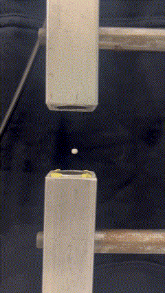
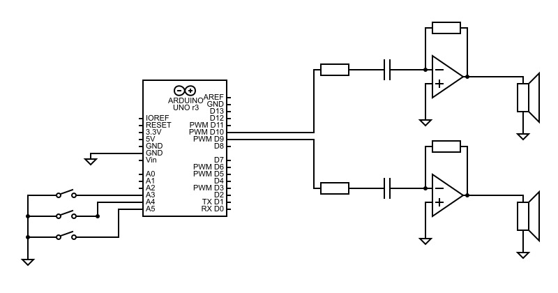
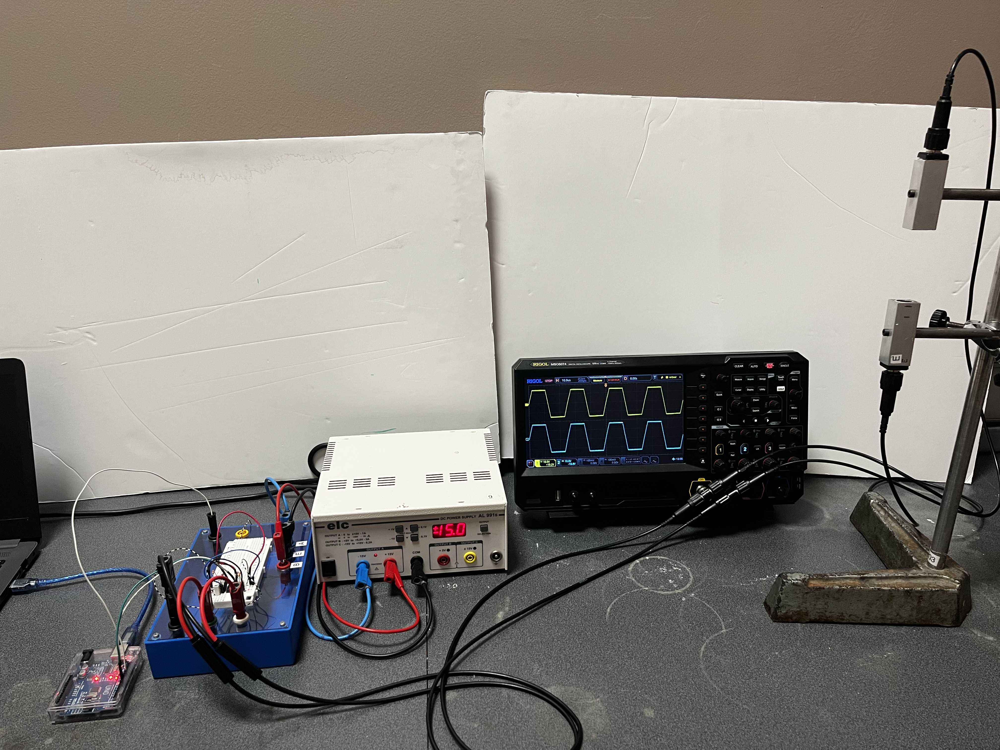
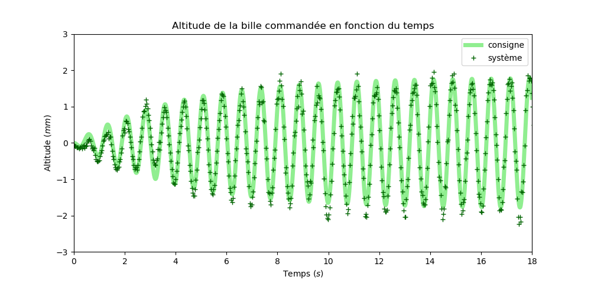
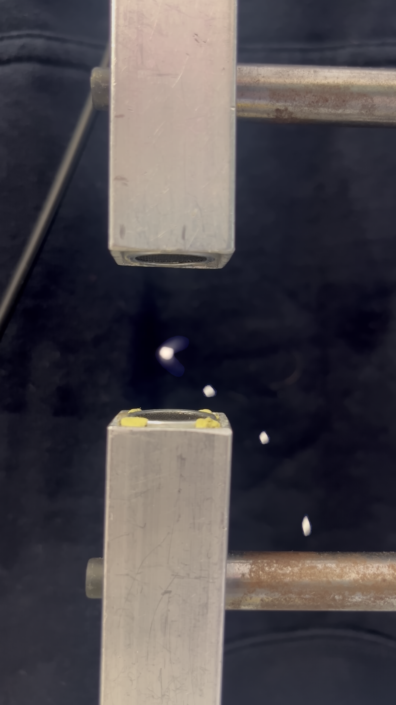
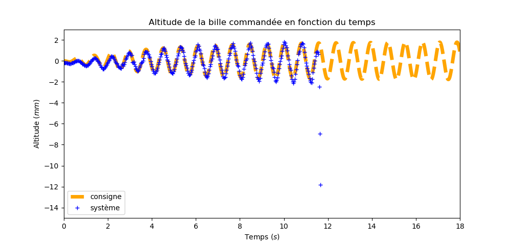

# Pinces Acoustiques : Manipulation de particules par ultrasons

Ce dépôt contient les travaux de recherche, de modélisation et d'implémentation d'un système de manipulation de particules sans contact en 1D.

    

## 1. Problématique et Enjeux
L'objectif est d'étudier la manipulation de micro-objets par forces de rayonnement acoustique. Des applications médicales autour de se système sont déjà envisagées dans la médecine douce comme pour le traitement des caillots sainguins.

## 2. Modélisation Théorique
Le principe du piège repose sur la création d'ondes stationnaires et la création d'un **potentiel de Gor'kov** ($U$).

### Équations Fondamentales
La force acoustique $F$ créée dérive du potentiel :
$$F = -\nabla U$$
$$U = K_1(|p|^2) - K_2(|p_x|^2 + |p_y|^2 + |p_z|^2)$$

* **$K_1, K_2$** : Constantes dépendant du volume de la bille et des masses volumiques (air vs polystyrène).
* **$p$** : Pression acoustique complexe résultant de la somme des pressions de chaque transducteur.

Ces équations sont issues des articles dans dans le dossier [research](./docs/research). Pour le détail complet des démonstrations, se référer au document [Methode1.pdf](./docs/research/Methode1.pdf) qui résume les formules utilisées pour les calcules théoriques dans le fichier Python [Calc.py](./src/PressureField/Calc.py).

### Algorithme de Contrôle
Pour piéger et déplacer la particule, on peut faire une simulation afin de visualiser les noeuds de stabilité. On peut l'observer à la rencontre des deux faisceaux :

    

## 3. Dispositif Expérimental
Le montage consiste en deux transducteurs ultrasonores face à face, créant un champ 1D.

- **Microcontrôleur :** Arduino ([ATMega328P](./docs/datasheets/ATmega328P.pdf)).
- **Transducteurs :** [Murata MA40S4S](docs/datasheets/MA40S4S.pdf) de fréquence centrale 40kHz.
- **Amplification :** Montage amplificateur inverseur alimenté en ±15V.

### Implémentation du déphasage
Le contrôle de la phase se fait via les registres de comparaison :
- `OCR1A` et `OCR1B` définissent les fronts du signal PWM.
- La fonction `SetPhase()` permet une mise à jour dynamique sans arrêt du signal. Elle assure une précision du déphasage inférieur à 1° soit une précision spatiale inférieure à 0.39mm
- Les bouttons sur les pins 4 et 5 de l'arduino servent à augmenter ou diminuer le déphasage de manière incrémentale. Le 3 sert, quant à lui, à imposer une consigne (comme le sinus montré plus bas).

    
    

## 4. Analyse et Résultats
J'ai commandé l'altitude de la bille en la suivant avec Tracker :

    
    

Puis j'ai poussé la stabilité du système à ses limites :

    
    

On peut observer en orange la consigne d'altitude et en bleu l'altitude réelle obtenue grâce à un enregistrement vidéo et Tracker pour extraire les données. Pour ce système, on otient une vitesse maximale de 12.8 mm/s avec une erreur maximale de 0.39 mm.

## 5. Structure du Dépôt
- [`/src`](./src) : Firmware Arduino (gestion des registres et modulation), modèles mathématiques et scripts d'analyse vidéo.
- [`/docs`](./docs) : Fiches techniques et schémas électroniques détaillés.

---
*Projet réalisé dans le cadre d'une étude sur la manipulation physique sans contact.*